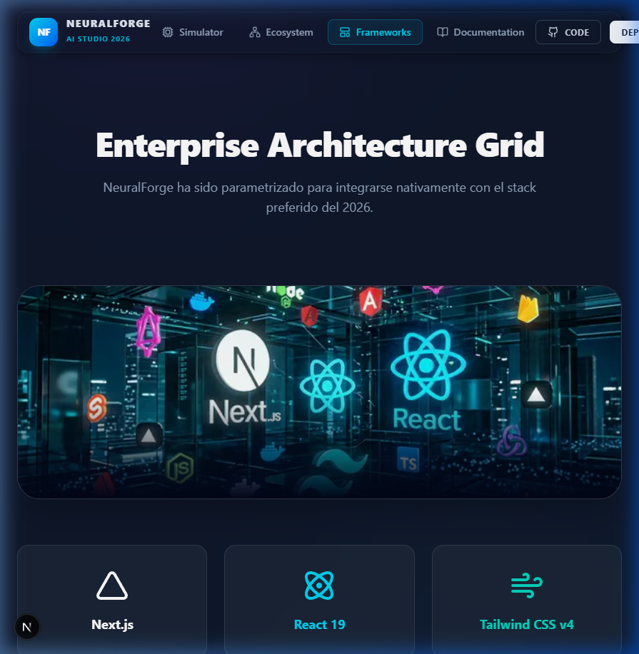
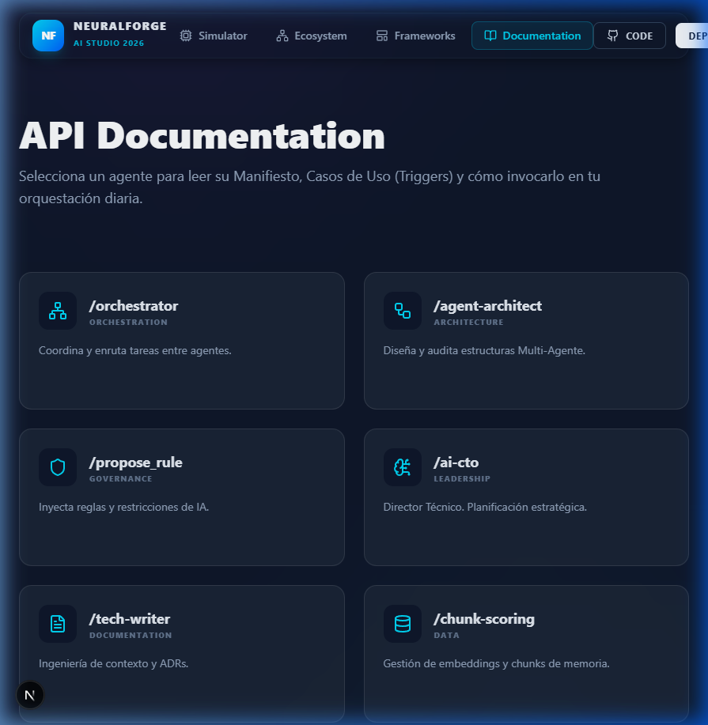

# 🚀 NeuralForge AI Studio — The 21-Skill Workforce


> **NeuralForge AI Studio** es una **arquitectura multi-capa de Inteligencia Artificial**. Un ecosistema de 21 Agentes Especializados (Supervisores y Workers) orquestados mediante el estándar *Agent Harness 2026*.
>
> 🌐 **Live Demo Target**: Diseñado para despliegue instantáneo en **Netlify** y **Vercel** usando Next.js 15 App Router.

---

## ✨ Características Premium (Mesh Protocol v4.4)

### 📊 **The Neural Handoff (Simulador Interactivo)**
- **Renderizado Visual**: Simulador de conexiones neuronales que fluyen desde el `/orchestrator` a múltiples workers.
- **Micro-Animaciones**: Fusión entre Framer Motion, Tailwind V4 Glassmorphism y sombras volumétricas.
- **Dynamic Routing**: Cada agente posee su propio `/docs/[skillId]` autogenerado mediante API con sus *Triggers* y *Constraints*.


### 🧠 **Jerarquía de Agentes (21 Skills OOTB)**

La infraestructura consta de 21 componentes de Cognitive Routing jerarquizado, donde ningún Worker escribe en producción sin la firma de un Supervisor.

| Rango | Role | Responsabilidades Clave |
| :--- | :--- | :--- |
| 🛡️ **Supervisor** | `/orchestrator`, `/agent-architect` | Firma de ejecución, Auditoría de Handoff, Routing. |
| ⚗️ **Integrator** | `/creativity`, `/propose_rule` | Inyección Out-Of-The-Box, Innovación asimétrica. |
| ⚙️ **Worker** | `/design-system`, `/supabase-postgres` | Ejecución atómica de código, Testing, DB Migrations. |

---

## 🏛️ Visual Architecture



### Stack Tecnológico del 2026
- **Frontend Core**: Next.js 15.0.4 (Turbopack) + React 19.0.0.
- **Styling**: Tailwind CSS v4 + Tailwind Merge + CVA.
- **Animations**: Framer Motion avanzado (Layout Transitions + SVG Path animation).
- **Icons**: Lucide React.
- **Ecosystem**: Node 22+ / Bun runtime ready.

## 📚 Dynamic Intelligence Docs



La plataforma inyecta su propia inteligencia de forma descentralizada. Puedes navegar a `/docs/[skill_id]` para auditar el Manifiesto de Delegación de cualquiera de las 21 Skills.

---

## 📦 Instalación Rápida & Deploy en Netlify

El entorno está preparado para ser clonado e inyectado a servidores Edge como Netlify/Vercel:

```bash
git clone https://github.com/JFrangel/AI-Agents-Skills.git
cd AI-Agents-Skills
npm install
npm run dev
```

### Configuración en Netlify:
- **Build command**: `npm run build`
- **Publish directory**: `.next` (o estándar de Netlify Next Runtime).

---

> **Generado vía Neural Forge (Giga-Blueprint Standard 2026)**
> *"Construido por Agentes, diseñado para Humanos."*
