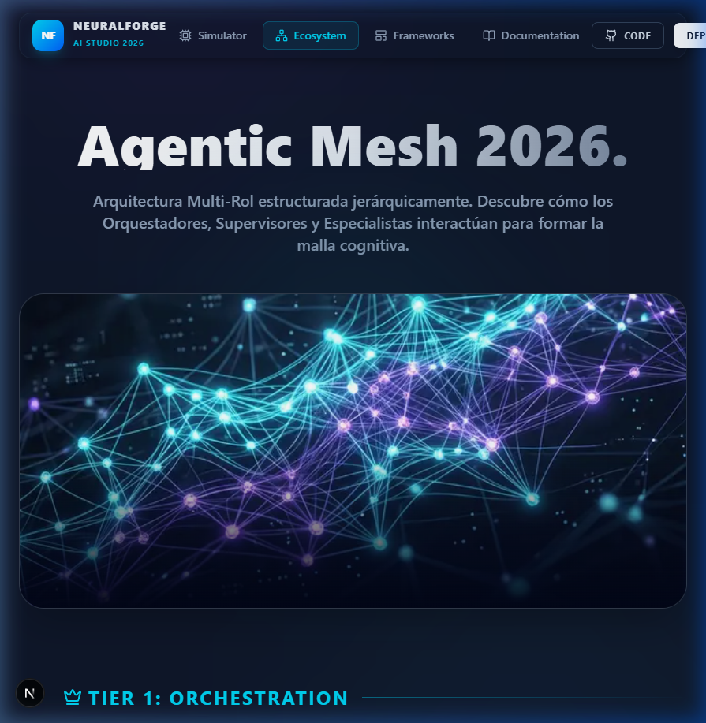

# 🚀 NeuralForge AI Studio — 21-Skill Agentic Mesh

[](https://opensource.org/licenses/MIT)
[](https://nextjs.org)
[](https://react.dev)
[](https://tailwindcss.com)
[](https://github.com/JFrangel/agents)

> **NeuralForge AI Studio** es una arquitectura multi-capa de Inteligencia Artificial. Un ecosistema de **21 Agentes Especializados** orquestados mediante el estándar *SOUL Protocol v2.0*.

---

## ✨ Features

| Feature | Descripción |
|:--------|:------------|
| 🧠 **21-Agent Mesh** | Orquestación jerárquica T1/T2/T3 con Neural Handoff |
| 🌐 **Physics-Based SVG** | ArchitectureMatrix con repulsión de cursor y datos animados |
| 🎨 **Glass UI 2026** | Glassmorphism premium + Framer Motion + scrollbar cyan temática |
| ⚡ **Simulator** | Simulación real del pipeline multi-agente con output dinámico |
| 📚 **Auto-Docs** | Cada skill genera su propia ruta `/docs/[skillId]` |
| 🔒 **SOUL Compliant** | Reality Check → Execute → Auto-Critique en cada agente |

---

## 🖥️ Screenshots




---

## 🏛️ Arquitectura Multi-Agente

```
┌──────────────────────────────────────────────────┐
│              T1: ORQUESTADOR                      │
│     /orchestrator · /agent-architect              │
│           (Token Authority)                       │
└──────────────┬───────────────────────────────────┘
               │ TOKEN ↓
┌──────────────┴───────────────────────────────────┐
│          T2: GOVERNANCE & DESIGN                  │
│  /creativity · /security-guard · /propose_rule    │
└──────────────┬───────────────────────────────────┘
               │ TOKEN ↓
┌──────────────┴───────────────────────────────────┐
│           T3: SPECIALIZED WORKERS                 │
│  /design-system · /supabase-postgres · /qa-tester │
│  /documentation · /analytics · /ml-trainer        │
└──────────────────────────────────────────────────┘
```

### Jerarquía de Roles

| Rol | Agentes | Responsabilidad |
|:----|:--------|:----------------|
| 🛡️ **Orquestador** | `/orchestrator`, `/agent-architect` | Firma, routing, auditoría |
| ⚗️ **Integrator** | `/creativity`, `/propose_rule` | Innovación, inyección OOB |
| 🔧 **Supervisor** | `/security-guard`, `/qa-tester` | Validación, compliance |
| ⚙️ **Worker** | `/design-system`, `/supabase-postgres`, ... | Ejecución atómica |

---

## 🚀 Stack Tecnológico

- **Frontend**: Next.js 15 (Turbopack) + React 19 (Server Components)
- **Styling**: Tailwind CSS v4 + `@theme` CSS Variables
- **Animations**: Framer Motion + Canvas API (physics-based)
- **Backend**: Supabase + PostgreSQL 16 + Prisma ORM
- **Icons**: Lucide React
- **Runtime**: Node.js 22+ / Bun compatible

---

## 📦 Instalación

```bash
# Clonar el repositorio
git clone https://github.com/JFrangel/agents.git
cd agents

# Instalar dependencias
npm install

# Iniciar desarrollo
npm run dev
# → http://localhost:3000

# Build de producción
npm run build
```

---

## 🗺️ Páginas y Rutas

| Ruta | Descripción |
|:-----|:------------|
| `/` | Simulator: landing + Neural Handoff Pipeline |
| `/ecosystem` | 21-agent mesh showcase con skill cards interactivas |
| `/frameworks` | Stack tecnológico con ArchitectureMatrix physics |
| `/docs` | Catálogo de skills agrupadas por categoría |
| `/docs/[skillId]` | Documentación individual auto-generada de cada skill |
| `/design-system` | Tokens, componentes y Architecture Matrix |

---

## 🤝 Contribuir

Lee [CONTRIBUTING.md](./CONTRIBUTING.md) para empezar.

```bash
git checkout -b feat/nueva-skill
# ... implementar ...
git commit -m "feat: add /nueva-skill agent"
git push origin feat/nueva-skill
# Abrir Pull Request
```

---

## 📋 Documentación

- [📖 WIKI.md](./WIKI.md) — Documentación técnica completa
- [📋 CHANGELOG.md](./CHANGELOG.md) — Historial de versiones
- [🤝 CONTRIBUTING.md](./CONTRIBUTING.md) — Guía de contribución
- [🧠 SOUL.md](./SOUL.md) — Protocolo de agentes
- [🏗️ IDENTITY.md](./IDENTITY.md) — Identidad del sistema

---

## 📄 Licencia

MIT License — ver [LICENSE](./LICENSE)

---

> *"Construido por Agentes, diseñado para Humanos."*  
> **Neural Forge — SOUL Protocol v2.0 · EST. 2026**
