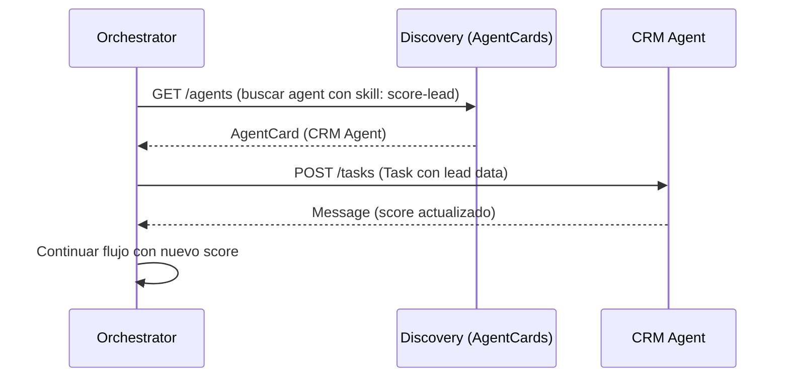

# A2A Protocol — Agent-to-Agent Handoff Pattern (Google 2025)

## ¿Qué es A2A?
El **Agent-to-Agent (A2A) Protocol** (Google, abril 2025) define un estándar para comunicación
entre agentes de IA de forma segura, tipada e interoperable. Permite que agentes de diferentes
plataformas (Gemini, Claude, GPT, etc.) se comuniquen con un protocolo común.

Spec: https://google.github.io/A2A/

---

## Tipos Principales

### AgentCard
Describe las capacidades de un agente — funciona como un "service discovery" de microservicios.

```json
{
  "agentId": "crm-agent-v1",
  "displayName": "CRM Lead Scoring Agent",
  "description": "Evalúa y actualiza scores de leads en Supabase/Firebase",
  "version": "1.0.0",
  "capabilities": {
    "streaming": false,
    "pushNotifications": true
  },
  "skills": [
    {
      "id": "score-lead",
      "name": "Score Lead",
      "description": "Calcula el score de un lead basado en eventos",
      "inputModes": ["text", "data"],
      "outputModes": ["data"]
    }
  ],
  "url": "https://api.example.com/agents/crm"
}
```

### Task
Unidad de trabajo enviada a un agente. Tiene estado persistente.

```json
{
  "id": "task-uuid-001",
  "sessionId": "session-uuid-123",
  "status": {
    "state": "working",  // submitted | working | input-required | completed | failed | canceled
    "message": null,
    "timestamp": "2025-03-08T14:00:00Z"
  },
  "input": {
    "role": "user",
    "parts": [
      {
        "type": "data",
        "data": {
          "leadId": "lead-42",
          "event": "pricing_page_view",
          "sessionDuration": 247
        }
      }
    ]
  }
}
```

### Message
Respuesta o actualización del agente hacia el cliente.

```json
{
  "role": "agent",
  "parts": [
    {
      "type": "data",
      "data": {
        "leadId": "lead-42",
        "newScore": 78,
        "stage": "MQL",
        "explanation": "pricing_page_view +25pts, sessionDuration > 120s +10pts"
      }
    }
  ]
}
```

---

## Flujo Completo de Handoff



---

## En el ecosistema neuralforge

Cada skill del ecosistema puede considerarse un agente A2A-compatible:
- **Orchestrator**: descubre y delega a skills via `delegations[]` JSON
- **AgentCard** de cada skill = la sección `tools[]` en el YAML de SKILL.md
- **Task** = el input de `user_query + context`
- **Message** = la respuesta formateada con el handshake
