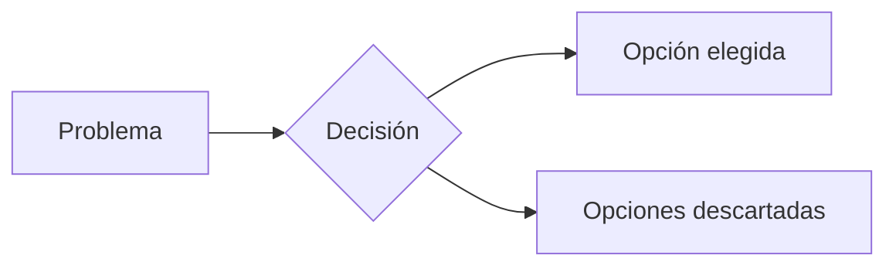

# ADR-000 — Template de Architecture Decision Record

> Copiar como `docs/adr/ADR-XXX-nombre-corto.md` y rellenar cada sección.

---

**Título**: [Título descriptivo — qué se decidió]
**Fecha**: YYYY-MM-DD
**Estado**: [Proposed | Accepted | Deprecated | Superseded by ADR-XXX]
**Autores**: [@github-handle]
**Revisores**: [@github-handle]

---

## Contexto

> ¿Cuál es el problema o situación que motivó esta decisión?
> ¿Qué restricciones o requisitos existen?
> ¿Cuáles son las alternativas que se evaluaron?

Describir el estado actual, el problema técnico o de producto, y cualquier constraint relevante
(performance, costo, tiempo, deuda técnica existente).

**Opciones evaluadas**:
1. [Opción A] — [ventaja] / [desventaja]
2. [Opción B] — [ventaja] / [desventaja]
3. [Opción C (la elegida)] — [ventaja] / [desventaja]

---

## Decisión

> ¿Qué se decidió hacer? Ser directo y claro.

Elegimos **[Opción C]** porque [razón principal concisa].

---

## Consecuencias

### Positivas
- [Beneficio 1]
- [Beneficio 2]

### Negativas / Trade-offs
- [Costo/limitación 1]
- [Costo/limitación 2]

### Riesgos identificados
- [Riesgo 1] → Mitigación: [cómo se mitiga]

---

## Links relacionados

- [PR donde se implementó](#)
- [Ticket o issue relacionado](#)
- [Documentación de referencia](#)
- ADR-XXX que esta decisión reemplaza (si aplica)

---

## Diagrama (opcional)

